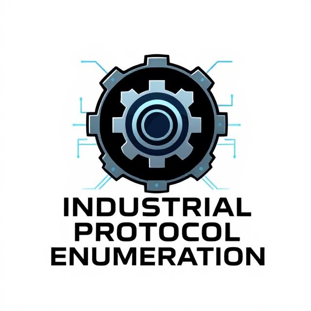

# Industrial Protocol Enumeration

  

This repository contains a collection of scripts and tools for enumerating various industrial protocols commonly used in ICS (Industrial Control Systems) and SCADA environments. Each folder focuses on a specific protocol and includes example scripts, instructions, and best practices for testing and research purposes.

## Contents

1. **[BACnet Protocol](./bacnet-protocol/)**
   - Scripts for enumerating BACnet/IP devices.
   - Queries various properties (firmware, model, vendor, etc.).
   - Useful for discovering and validating BACnet deployments.

2. **[DNP3 Protocol](./dnp3-protocol/)**
   - Tools for scanning DNP3 servers, fuzzing unsupported group/variation pairs, and writing data.
   - Helps in testing DNP3 implementations for robustness and security.

3. **[EIP Protocol (EtherNet/IP)](./eip-protocol/)**
   - Enumerates tags, reads, and writes values on PLCs using EtherNet/IP.
   - Useful for testing and validation of Rockwell Automation (Allen-Bradley) devices.

4. **[Modbus Protocol](./modbus-protocol/)**
   - Scripts for enumerating and modifying data on Modbus TCP devices.
   - Supports reading/writing coils and registers for basic Modbus testing.

5. **[MQTT Protocol](./mqtt-protocol/)**
   - Subscribes to MQTT topics, filters, and modifies incoming messages.
   - A lightweight protocol often used in IoT and industrial telemetry.

6. **[S7 Protocol](./s7-protocol/)**
   - Connects to Siemens S7 PLCs, retrieves device info, scans data blocks, and reads/writes data.
   - Ideal for testing S7-based environments in industrial settings.
